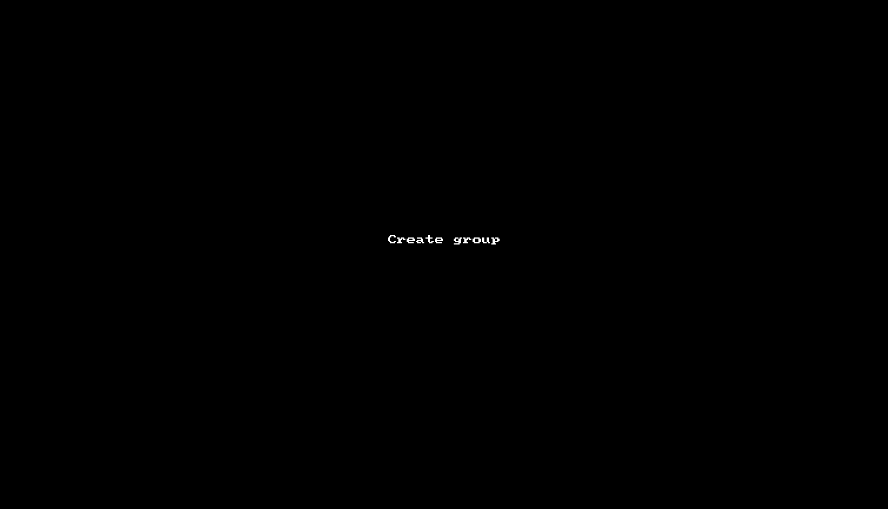
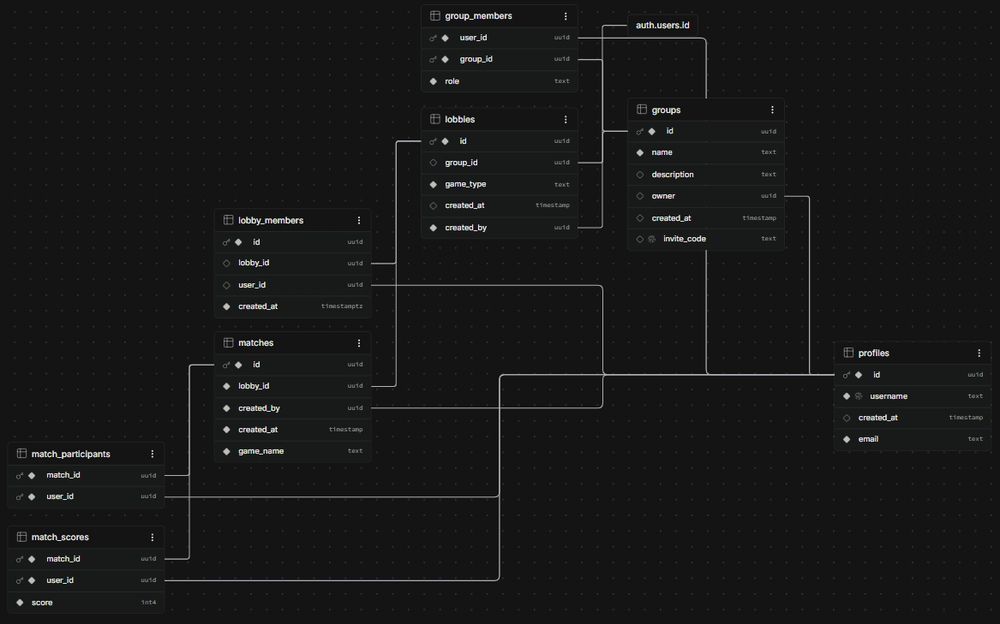

# Beat Your Friend - React and TypeScript app
The project allows users to save scores for a group of friends in different categories. Users can motivate and challenge themselves

## Link to the project: [Beat Your Friend](https://byf-eight.vercel.app/)

## BYF allows to:
* Create an account and login
* Create a group with invitation code
* Join your friend's group by invitation code
* Create a lobby in a group
* Join any lobby as a group member
* In a lobby create match with your friend and save result
* View leaderboard with scores of all matches in a lobby

## Watch the example of the application flow:

  
  

  
  

## Tech Stack:
* **React**
* **TypeScript**
* **React Query**
* **React Hook Form**
* **Yup**
* **MUI**
* **Jest**
* **Supabase**

## Table of contents
* [Architecture](#architecture)
* [Database](#database)
* [RPC functions](#rpc-functions)
* [Frontend](#frontend)
* [Testing](#testing)

## Known issues (Work in progress)
* This application is still ongoing. For now RLS on profiles table is open publicly - will be changed to view 
* lobbies.created_by references auth.users instead of profiles.id - relations: [Database](#database)
* create_group RPC accepts owner id as parameter instead of reading it from JWT - user could potentially pass another user's id
* LoginPage and RegisterPage styling uses Tailwind instead of MUI - planned refactor to keep consistency
* Yup validation schemas are placed in utils instead of their corresponding feature folders
* Folder structure requires refactoring - matches and leaderboard are nested inside other features instead of being separate feature folders

## Plans 
* Implement features: users comments, lobby rules, accept match result by participants
* Refactor CRA to Vite
* Test app with Playwright 
* Refactor folder structure more to feature based

## Architecture

### Why React?
I'm not sure how Beat Your Friend will evolve. The advantages of React's component model and rich ecosystem (React Query, React Router, React Hook Form) made it the right choice. React's component-based architecture makes the application easier to maintain and scale, while the Virtual DOM efficiently updates only the necessary parts of the UI. React Router handles navigation without page reloads. React Query delivers data from cache.

### Why Supabase?
Supabase allowed to create app without coding backend which means:
* create relational database
* authenticate users
* write Row Level Security policies
* write RPC functions imitating backend

### Why React Query
This application mainly works with fetching and updating data to the server. Caching data from the server, automatically refetches and loading/error states out of the box are the very efficient solution in this case. 

### Architecture Decisions

#### React Query instead of useState + useEffect
Initially data fetching was done with useState and useEffect. 
As the app grew, managing loading states, error handling and cache invalidation became complex.
Migrating to React Query simplified this significantly.

---

#### RPC functions instead of direct queries for complex operations
Operations touching multiple tables (create match, delete group) were moved to Supabase RPC functions.
This allowed to handle transactions and business logic on the database level instead of the frontend.

---

#### One component for register and login instead of two separated
LoginPage and RegisterPage share one LoginRegisterPage component for code reusability. I noticed that considerable part of code in those components was the same. 

---

#### Supabase generated types instead of custom types
Initially I wrote custom TypeScript types for data returned from Supabase queries. 
As the schema grew, keeping custom types in sync with the database became error-prone.
Switching to Supabase generated types ensured the frontend always reflects the actual database schema.

---

#### Supabase instead of Java backend
The project originally included a Java backend. 
Decided to replace it with Supabase to eliminate the need for maintaining a separate backend service and to focus on frontend development and architecture.

---

#### Centralized error handling
I made a function named getErrorMessage to handle errors (converting object to a string) instead of checking by hand what kind of error is thrown. The app is easier to scale.

---

#### React Hook Form instead of controlled inputs
I decided to use RHF to avoid unnecessary re-renders and keep consistent approach across all forms in the project. Yup was added as a separate validation library integrated through yupResolver.

---

#### Feature-based folder structure
Refactored from a view-based structure to feature-based. Each feature (auth, groups, lobbies) contains its own components, hooks, services and types. Better for scalability and keeping related code together.

### Data flow
* Example data flow (create group feature):
1. User clicks create group button for open form
2. User fills data (group name and optionally description) and submits form
3. React Hook Form + Yup handles validation
4. On success custom hook calls service function - createGroup
5. Service calls supabase RPC function - create_group (database level)
6. RPC returns data - group id
7. React Query cache invalidated
8. UI updates automatically
9. Toast notification shown to user

## Database

### Tables 

#### Relations
* profiles -> groups (many to many)
* profiles -> group_members (one to many)
* groups -> group_members (one to many)
* auth.users.id -> lobbies (one to many)
* groups -> lobbies (one to many)
* profiles -> lobby_members(one to many)
* lobbies -> lobby_members(one to many)
* lobbies -> matches (one to many)
* profiles -> matches (one to many)
* matches -> match_participants (one to many)
* matches -> match_scores (one to many)
* profiles -> match_participants (one to many)
* profiles -> match_scores(one to many)

## RPC functions

### create_group
* **Purpose:** Creates new group with group name and description
* **Parameters:** 
  * input_description: string
  * input_name: string
  * input_owner: string 
* **Returns:** Group id as a string
* **Errors:** Not authenticated

### create_match
* **Purpose:** Creates new match with minimum two players and scores
* **Parameters:** 
  * input_game_name: string
  * input_lobby_id: string
  * input_participants: Json: 
     * user_id: string
     * score: number
* **Returns:** Match id as a string
* **Errors:** 
  * `Not authenticated`
  * `Lobby is required`
  * `Game name is required`
  * `At least 2 participants required`
  * `You must belong to this lobby`
  * `Participant is not in this lobby`

### delete_group
* **Purpose:** Deletes group
* **Parameters:** input_group_id: string
* **Returns:** undefined
* **Errors:** 
  * `Not authenticated`
  * `You are not the owner of this group`

### delete_group_member
* **Purpose:** Deletes group member
* **Parameters:** 
    * target_group_id: string 
    * target_user_id: string
* **Returns:** undefined
* **Errors:** 
  * `Not authenticated`
  * `Do not have permission`
  * `Cannot kick yourself`

### delete_lobby
* **Purpose:** Deletes lobby
* **Parameters:** input_lobby_id: string
* **Returns:** undefined
* **Errors:** 
  * `Not authenticated`
  * `You are not the owner of this lobby`

### delete_match 
* **Purpose:** Deletes match
* **Parameters:** input_match_id: string
* **Returns:** undefined
* **Errors:** 
  * `Not authenticated`

### get_group_leaderboard
* **Purpose:** Gets group members with total score in a descending order
* **Parameters:** input_group_id: string
* **Returns:** Array of:
  * total_score: number
  * user_id: string
  * username: string

### get_lobby_leaderboard
* **Purpose:** Gets lobby members with total score in a descending order
* **Parameters:** input_lobby_id: string
* **Returns:** Array of:
  * total_score: number
  * user_id: string
  * username: string

### join_group_by_code
* **Purpose:** Joins user to group by invitation code
* **Parameters:** code: string
* **Returns:** Group id as a string
* **Errors:** 
  * `Invalid invite code`
  * `Not authenticated`
  * `Already a member`

### leave_group
* **Purpose:** User leaves group
* **Parameters:** input_group_id: string
* **Returns:** undefined
* **Errors:** 
  * `Not authenticated`
  * `Not a member`
  * `Owner cannot leave group`

### leave_lobby
* **Purpose:** User leaves lobby
* **Parameters:** input_lobby_id: string
* **Returns:** undefined
* **Errors:** 
  * `Not authenticated`

## Frontend

### Authentication
* **Register and login with username or email**
* **Protected routes - unauthenticated users are redirected to login**

### Groups
* **Create group with name and description**
* **Join group by invitation code**
* **Leave group (only member)**
* **Delete group (only owner)**
* **Delete group member (only owner)**
* **View group leaderboard**

### Lobbies
* **Create lobby with name**
* **Join lobby (only group member)**
* **Leave lobby**
* **View lobby leaderboard**

### Matches
* **Create match with scores - min. 2 players**
* **View matches history**
* **Delete match (only creator)**

## Testing

### Unit tests

#### Authentication
* **CustomInputField** - renders with label and helper text, toggles password visibility
* **Form** - validation, submit, error handling

#### Groups
* **CreateGroupForm** - validation, submit
* **JoinGroup** - validation, submit

#### Lobbies
* **CreateLobbyForm** - validation, submit

#### Matches
* **CreateMatchForm** - validation, submit

#### Utils 
* **podiumUtils** - empty array, single player, sorts descending by score, assigns same place for equal scores

